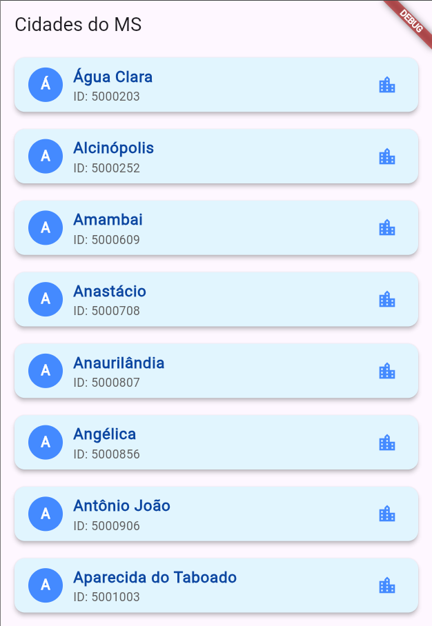

# 📱 Exemplo de Consumo de API no Flutter

Este projeto Flutter tem como objetivo demonstrar como consumir a API de Localidades do IBGE. O aplicativo exibe uma lista de todas as UFs do Brasil e, em uma segunda funcionalidade, exibe todas as cidades do estado de **Mato Grosso do Sul (MS)**.

## 🚀 Funcionalidades

- ✅ Listar todas as UFs do Brasil
- ✅ Listar todas as cidades do Mato Grosso do Sul (MS)
- ✅ Consumo de API utilizando o pacote `http`
- ✅ Exibição dos dados em listas estilizadas

---

## 🎥 Demonstração

<!-- Se quiser, adicione um print aqui -->


---

## 🔗 API utilizada

- 🌐 [API de Localidades do IBGE](https://servicodados.ibge.gov.br/api/docs/localidades)

---

## 🛠️ Tecnologias

- ✅ **Flutter** 
- ✅ **Dart**
- ✅ `http` (para requisições HTTP)
- ✅ Widgets como `ListView`, `FutureBuilder`, `Card`, `ListTile`

---

## 📦 Estrutura de pastas

```plaintext
lib/
├── main.dart
├── model/
│   └── uf.dart
├── services/
│   └── uf_services.dart
```

---

## ⚙️ Como executar o projeto

1. Clone este repositório:

```bash
git clone https://github.com/MMCAC/cx-ifms-tsi-pmd-ex-4.git
```

2. Acesse a pasta do projeto:

```bash
cd lib
```

3. Instale as dependências:

```bash
flutter pub get
```

4. Execute o app:

```bash
flutter run
```

---

## ✅ Dependências

- [`http`](https://pub.dev/packages/http) — ^0.13.5
- `flutter` — versão estável

---

## 💡 Observações

- Este projeto é acadêmico, desenvolvido para fins de aprendizado na disciplina de **Programação para Dispositivos Móveis**.
- A API do IBGE não requer autenticação.

---

## 👨‍🏫 Créditos

- Desenvolvido por **Maicon Cezar Azambuja da Cunnha**
- Professor: **[Gustavo Yoshio Maruyama]**
- Curso: **[Tecnologia em Sistemas para Internet]**
- Universidade: **[Instituto Federal de Educação, Ciência e Tecnologia de Mato Grosso do Sul - IFMS (Câmpus Coxim)]**

---

## 📜 Licença

Este projeto é de uso acadêmico e livre para estudos.
